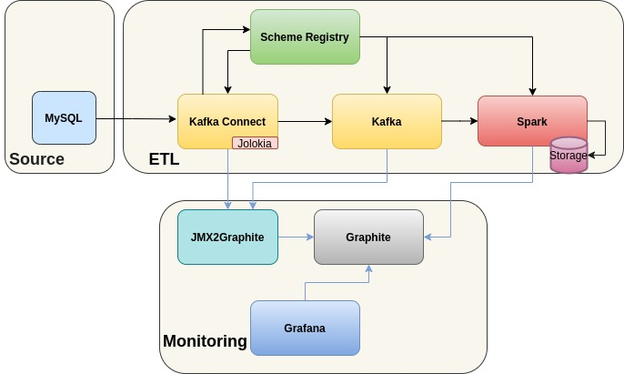

# mysql-kafka-connect-spark-etl
A simple ETL pipeline to extract mysql data make simple transformation and save as parquet files

The pipeline is for demonstration purposes to show how to continuously stream the data from mysql, make transformations and load to a final storage.
In the following illustration the only transformation is converting to parquet format and saving to a storage. However since we used Spark we could apply all the required business requirements accordingly.

The pipeline design looks like this:

## Used Services:

### ource:
* Mysql database
### ETL:
* Kafka Connect - continuously extracts new rows and row updates from MySQL
* Kafka - records are pushed to Kafka topic
* Spark - streaming job which consumes new data from Kafka, converts to Parquet and stores to local storage
  * In the production system the storage would be for instance HDFS or AWS S3
* Schem Registry - used to store and retrieve schema for mysql records
### Monitoring:
* JMX2Graphite - service is used to push the jmx metrics from Kafka-Connect to Graphite
* Graphite - Is used as a time series database to store system generated metrics
  * In the current implementation Kafka-Connect and Spark generate metrics (Kafka can be easily added as well)
* Grafana - time series database visualization tool used for building metric monitoring/alerting dashboard

### How to Access ETL processed data:
* Data is stored locally to spark cluster. data can be accessed with the following command
  * docker exec -it spark ls -la /tmp/etl-data/
### How to view the metrics:
* Metrics are exported from KafkaConnect (default metrics) and Spark Job (default metrics and custom created ones)
* Metrics can be accessed via opening predefined Grafana dashboard with the following URL:
  * localhost:3000 and navigating to the dashboard called Metrics
* IMPORTANT: Initially It can take up to 15 minutes for spark metrics to apear in Graphite
* IMPORTANT: In order to see new datapoints for metrics, activity in MySql side should be done
* Alerts can be easily configured to send slack or email notifications (not done)

### How to Build the infrastructure and run the ETL job

* In order to build the infra and run the ETL run please the following command:
  * sh bootstrap.sh
* What is does:
  * build the spark job for simple data transformations
  * call docker-compose to start all the required services
  * copy all the required dependencies for KafkaConnect, Spark Job
  * create Kafka Connect mysql connector
  * start the spark job
  * import the predefined datasource and dashboard to grafana
* Stop and remove running containers:
  * docker-compose down

#### This way of infra creation and job deployment is just for demonstration purposes, not meant to be used in production
